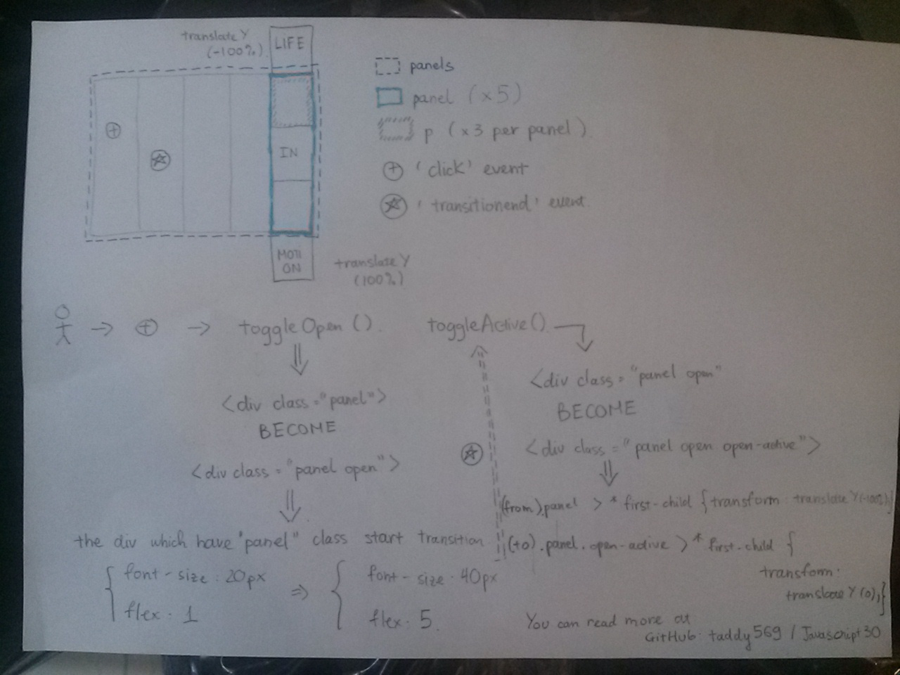

# Day 5: Flex Panels Image Gallery

## Ready to work

  1. HTML file:
  2. CSS file:
      * What is *display: flex*, you can read [here](https://www.w3schools.com/cssref/css3_pr_flex.asp).
      * [Transition](https://www.w3schools.com/css/css3_transitions.asp) property.
      * [Transform](https://www.w3schools.com/css/css3_2dtransforms.asp) property.

      * Some note about CSS selector:

      | Example | Example description |
      | ------- | ------------------- |
      .panel > * | select all child elements of element that have class is "panel"
      .panel > *:first-child | select every element that is first-child of element have class is "panel"
      .panel.open-active > *:first-child | select every element that is first-child of element have class is "panel" and "open-active"
      .panel p | select all paragraph elements that is child node of element have class "panel"
      .panel p:nth-child(2) | select second paragrahp element that is child node of element have class "panel
      .panel.open | select all elements that have class "panel" and class "open"

      * [Media query](https://www.w3schools.com/css/css3_mediaqueries.asp)

## Step by step JavaScript guide

1. we add event load for windown object by a function named "init"

   ```javascript
   window.addEventListener('load', init);
   ```

2. we declare init function

   ```javascript
   function init() {
     const panels = document.querySelectorAll('.panel');
     panels.forEach(panel => {
       panel.addEventListener('click', toggleOpen);
       panel.addEventListener('transitionend', toggleActive);
     });
   }
   ```

   we select all element that have class is "panel", and for each element in nodelist result, we add two event for that:
     1. 'click' event with handle function toggleOpen
     2. 'transitionend' event with handel function toogleActive

3. we declare two helper functions

   ```javascript
   function toogleOpen() {
     this.classList.toggle('open');
   }

   function toggleActive(event) {
     if (event.propertyName.includes('flex')) {
       this.classList.toggle('toggleActive');
     }
   }
   ```

   *toggle* method: you can image that like a bulb, when switch **ON**, bulb light **ON** and vice versa. This method add or remove class from element.

4. You can see the map below for more clear, I was try to describe the process. If you find something not true, please let me know :D

   

## Putting it all together

   ```javascript
   window.addEventListener('load', init);
   function init() {
     const panels = document.querySelectorAll('.panel');
     panels.forEach(panel => {
       panel.addEventListener('click', toggleOpen);
       panel.addEventListener('transitionend', toggleActive);
     });
   }

   function toggleOpen() {
     this.classList.toggle('open');
   }

   function toggleActive(event) {
     if (event.propertyName.includes('flex')) {
       this.classList.toggle('toggleActive');
     }
   }
   ```

## Something cool in the future

More effect, horizontal picture flex-box, ...